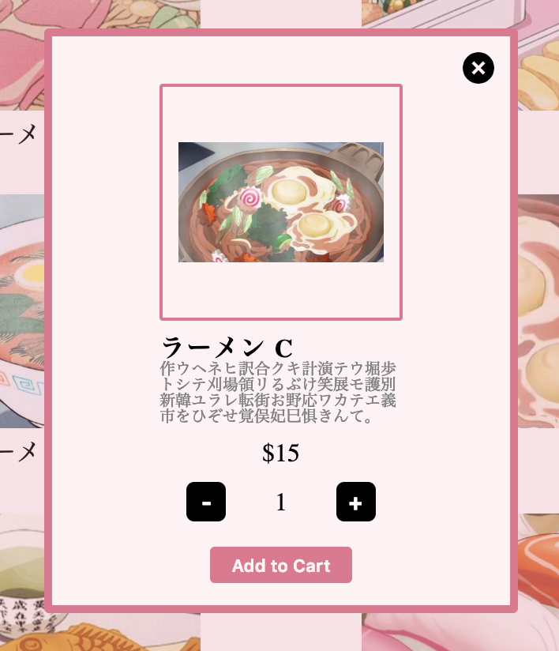

# Anime Food

### Background 

This site is a simple javascript application. I wanted to create a restaurant site for my love of anime food. The technologies I used are Javascript, HTML5, and CSS3. 

### Future Implementations

In the future, I would love to:

1. have a coupon code section 
2. have a checkout page
3. a menu (svg)
4. google geolocation api
5. delivery page

### CODE
#### header


Below is the code for the header to change to a smaller more color version.

```
function header() {
  if (document.body.scrollTop > 10 || document.documentElement.scrollTop > 10) {
    let smallLogo = document.getElementById("logo");
    let smallLogoOutline = document.getElementById("logo-outline");
    smallLogo.className = "scroll-logo";
    smallLogo.style.width = "100px";
    smallLogoOutline.style.width = "104px";
    smallLogoOutline.style.height = "105px";
    smallLogoOutline.style.border = "solid 5px rgb(218, 122, 143)";
    let nav = document.getElementsByClassName("nav");
    for (let i = 0; i < nav.length; i++) {
      nav[i].style["font-size"] = "13px";
      nav[i].style["bottom"] = "50px";
      nav[i].style["transition"] = "font-size .3s";
      nav[i].style["transition"] = "bottom 1s";
      nav[i].style["color"] = "rgb(218, 122, 143)";
    }
  } else {
    let bigLogo = document.getElementById("logo");
    let bigLogoOutline = document.getElementById("logo-outline");
    bigLogo.style.width = "120px";
    bigLogo.className = "";
    bigLogoOutline.style.width = "120px";
    bigLogoOutline.style.height = "120px";
    bigLogoOutline.style.border = "none";
    bigLogoOutline.style.border = "none;";
    let nav = document.getElementsByClassName("nav");
    for (let i = 0; i < nav.length; i++) {
      nav[i].style["font-size"] = "15px";
      nav[i].style["bottom"] = "60px";
      nav[i].style["transition"] = "font-size .3s";
      nav[i].style["transition"] = "bottom 1s";
      nav[i].style["color"] = "white";
    }
  }
}
```
#### Modal


```
box.onclick = function() {
        document.getElementById("active-cart").style["display"] = "inherit";
        let escape = document.getElementById("popup");
        escape.style["display"] = "flex";
        let backdrop = document.getElementById("background");
        backdrop.style["display"] = "inherit";
        let populate = document.getElementById("item-cost");
        let populateName = document.getElementById("item-name");
        let populateImage = document.getElementById("item-image");
        if (populate.hasChildNodes()) {
          populate.removeChild(populate.childNodes[0]);
          populate.append(store[i].cost);
        } else {
          populate.append(store[i].cost);
        }
        if (populateImage.hasChildNodes()) {
          populateImage.removeChild(populateImage.childNodes[0]);
          populateImage.setAttribute("src", store[i].image);
        } else {
          populateImage.setAttribute("src", store[i].image);
        }
        if (populateName.hasChildNodes()) {
          populateName.removeChild(populateName.childNodes[0]);
          populateName.append(store[i].name);
        } else {
          populateName.append(store[i].name);
        }
      };
      totalbox.append(box, text);
      parent.append(totalbox);
    }
  }
```
#### cart

Below is the code that calculates the total based on what is in the cart.

```
function calcTotal() {
  let listOfCart = document.getElementsByClassName("addingItem");
  listOfCart = Array.from(listOfCart);
  let arrOfCart = listOfCart.map(el => {
    let indexOfMoney = el.innerHTML.indexOf("$");
    let costPerItem = el.innerHTML.slice(indexOfMoney + 1);
    if (costPerItem.indexOf("X") === -1) {
      return parseInt(costPerItem);
    } else {
      let indexOfAmount = costPerItem.indexOf("X");
      let a = costPerItem.slice(0, indexOfAmount);
      let b = costPerItem.slice(indexOfAmount + 1);
      return parseInt(a) * parseInt(b);
    }
  });
  let total = document.getElementById("totalCost");

  arrOfCart.length
    ? (total.innerHTML =
        "$" +
        arrOfCart.reduce((acc, curr) => {
          return acc + curr;
        }))
    : (total.innerHTML = "$0");
}

```

